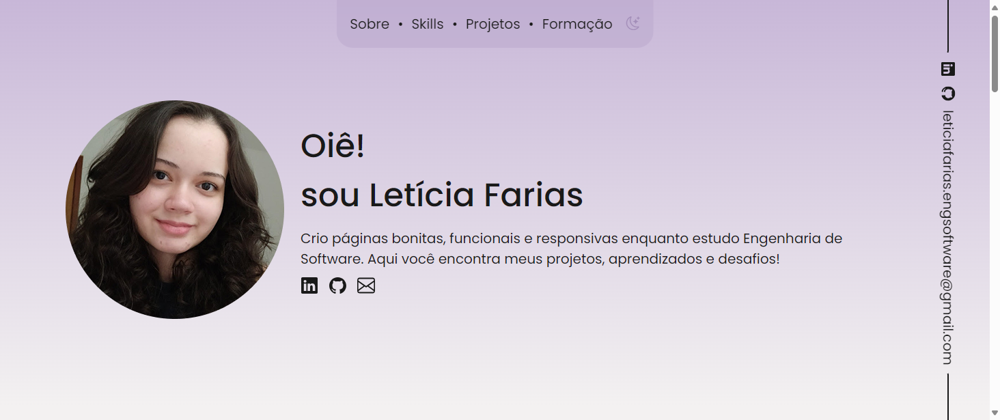

# Portfólio - Letícia Farias

Este projeto é um site de portfólio pessoal desenvolvido para apresentar meus projetos, habilidades e experiências como estudante de Engenharia de Software. O objetivo é oferecer uma visão clara e organizada da minha trajetória.

## Funcionalidades

- Seção de projetos com imagens e descrições
- Links para repositórios no GitHub
- Contato com ícones de redes sociais
- Layout responsivo para desktop e mobile
- Alternância de temas

## Tecnologias Utilizadas

- HTML5
- CSS3
- JavaScript 

## Objetivo

Criar um portfólio online para destacar minhas competências técnicas, facilitar o acesso aos meus projetos públicos e servir como cartão de visita digital em processos seletivos.

## Preview

  

## Como visualizar

Você pode acessar o projeto publicado em:  
[https://leticia-farias.github.io/portfolio/](https://leticia-farias.github.io/portfolio/)
